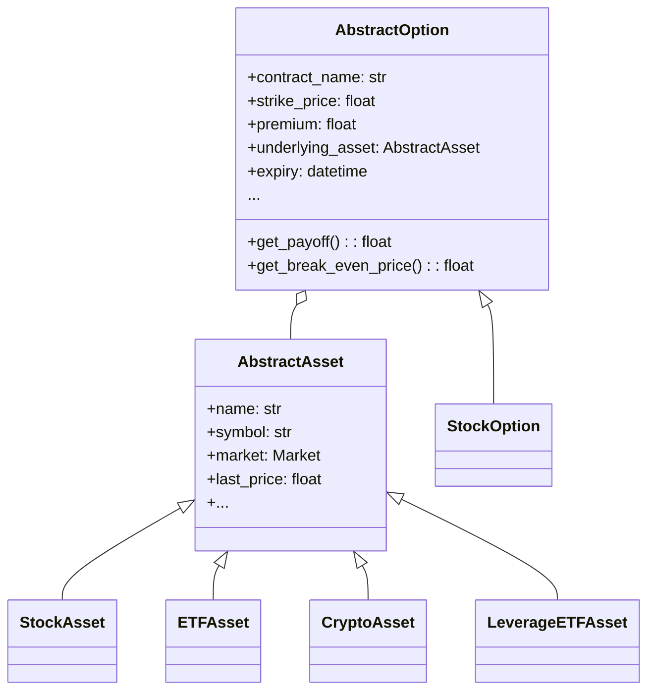
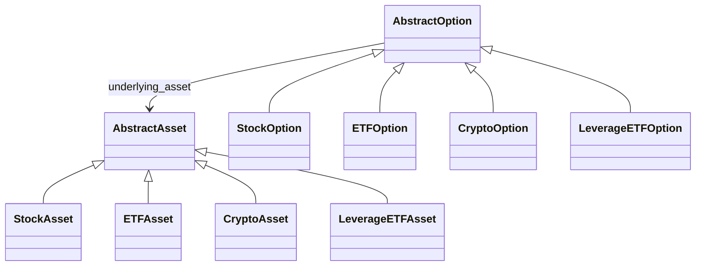
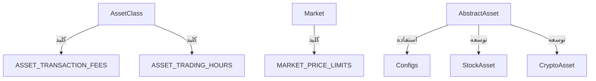

<div dir='rtl'>

</div>

# 📦 بخش اول: معرفی و ساختار

---

## 🧭 هدف لایه Entity در معماری پاک (Clean Architecture)

لایه `Entity` در معماری پاک (Clean Architecture) به‌عنوان قلب دامنه‌ی پروژه شناخته می‌شود. این لایه مستقل از فریمورک‌ها، پایگاه داده، API، UI یا هر وابستگی خارجی دیگر عمل می‌کند و شامل مدل‌های دامنه (Domain Models) است که رفتارهای اصلی سیستم را توصیف می‌کنند.

> 🎯 **هدف کلیدی این لایه**:
> پیاده‌سازی منسجم مفاهیم تجاری (Business Rules) و مدل‌های اصلی سیستم به شکلی که قابل تست، توسعه‌پذیر و مستقل از تغییرات تکنولوژیک باشند.

---

## 🧱 اجزای اصلی لایه Entity


</div>

```
core/
└── entities/
    ├── asset/
    │   ├── asset.py
    │   ├── stock_asset.py
    │   ├── crypto_asset.py
    │   ├── etf_asset.py
    │   └── leverage_etf_asset.py
    ├── option/
    │   ├── option.py
    │   └── stock_option.py
    ├── enum/
    │   └── enums.py
```
<div dir='rtl'>

### 🔹 1. `asset/`

مدیریت انواع دارایی پایه (سهام، صندوق، کریپتو) با ویژگی‌ها و قواعد خاص بازار

### 🔹 2. `option/`

تعریف انتزاعی و پیاده‌سازی آپشن‌ها (اختیار معامله) شامل متدهای Payoff، وضعیت قرارداد و ...

### 🔹 3. `enum/`

تعریف مقادیر ثابت مانند انواع دارایی، وضعیت قرارداد و نوع اختیار معامله

---

## 🧩 کلاس‌ها و متدهای کلیدی لایه Entity

| کلاس / ماژول       | توضیح                  | متدهای کلیدی                                                     |
| ------------------ | ---------------------- | ---------------------------------------------------------------- |
| `AbstractAsset`    | کلاس پایه دارایی‌ها    | `get_price_limit()`, `get_transaction_fee()`, `is_trading_now()` |
| `StockAsset`       | پیاده‌سازی سهام        | -                                                                |
| `CryptoAsset`      | پیاده‌سازی کریپتو      | -                                                                |
| `ETFAsset`         | پیاده‌سازی صندوق ETF   | -                                                                |
| `LeverageETFAsset` | پیاده‌سازی صندوق اهرمی | -                                                                |
| `AbstractOption`   | کلاس پایه آپشن         | `get_payoff()`, `get_break_even_price()`, `contract_status()`    |
| `StockOption`      | پیاده‌سازی آپشن سهام   | -                                                                |
| `enums.py`         | انواع ثابت             | `AssetClass`, `Market`, `OptionType`, `ContractStatus`           |

---

## 🧰 به‌کارگیری اصول SOLID در این لایه

| اصل       | کاربرد در Entity Layer                                                                                                |
| --------- | --------------------------------------------------------------------------------------------------------------------- |
| ✅ **SRP** | هر کلاس تنها مسئول یک نوع دارایی یا مدل مالی است. مانند `StockAsset` برای سهام یا `AbstractOption` برای قرارداد آپشن. |
| ✅ **OCP** | قابلیت افزودن دارایی یا استراتژی جدید بدون تغییر کلاس‌های موجود از طریق ارث‌بری و دیکته کردن اینترفیس‌ها              |
| ✅ **LSP** | کلاس‌های فرزند مانند `CryptoAsset` بدون شکستن رفتار والد (`AbstractAsset`) جایگزین می‌شوند                            |
| ✅ **ISP** | از @abstractmethod برای تعیین رفتارهای خاص بدون تحمیل توابع اضافی استفاده شده                                         |
| ✅ **DIP** | وابستگی‌ها به‌صورت وابسته به اینترفیس طراحی شده‌اند، نه به کلاس‌های مشخص                                              |

---

## 🔍 اهمیت Type Hinting در این لایه

* تمام کلاس‌ها دارای `Type Hint` برای سازگاری با ابزارهای تست و CI/CD هستند.
* استفاده از `Optional`, `Tuple`, `Enum`, `@dataclass` در سطح بالا.
* کمک به تحلیل ایستا (Static Analysis)، خودکارسازی تست‌ها و جلوگیری از خطاهای منطقی.


# 📘 بخش دوم: معماری و روابط

---

## 🧱 ساختار ارتباط کلاس‌ها در لایه Entity

در این لایه، کلاس‌ها به‌شکل **انتزاعی (abstract)** و **تخصص‌یافته (specialized)** طراحی شده‌اند تا:

1. اصول **Open/Closed** و **Liskov Substitution** را رعایت کنند.
2. لایه‌ی منطق کسب‌وکار (Domain Logic) را به‌صورت جداگانه از سایر لایه‌ها نگهداری کنند.
3. بدون نیاز به پایگاه‌داده، UI یا API، قابل تست و توسعه باشند.

### 🔗 ساختار وابستگی‌ها (Dependency Flow)



---

## 🧩 ارتباط بین ماژول‌های اصلی

| ماژول              | وابسته به                                   | توضیح                                                                                             |
| ------------------ | ------------------------------------------- | ------------------------------------------------------------------------------------------------- |
| `asset.asset.py`   | `config.*`                                  | از فایل‌های `trading_rules.py` و `market_rules.py` برای تعیین کارمزد و دامنه نوسان استفاده می‌کند |
| `option.option.py` | `asset.asset.py`                            | هر آپشن نیازمند دسترسی به دارایی پایه (`underlying_asset`) است                                    |
| `enum.enums.py`    | مستقل                                       | توسط تمامی کلاس‌های Asset و Option برای تعیین نوع، وضعیت، بازار استفاده می‌شود                    |
| `stock_option.py`  | `option.option.py` + `asset.stock_asset.py` | نمونه پیاده‌سازی دقیق برای Option مبتنی بر سهام                                                   |

---

## 📐 نمودار لایه‌ای (Layered View)

</div>

```
core/entities/
├── asset/         <-- دارایی پایه (سهام، کریپتو، ETF، ...)
│   └── AbstractAsset  <-- نقطه ورود کل Option ها
├── option/        <-- قرارداد آپشن
│   └── AbstractOption <-- تعریف انتزاعی اختیار معامله
└── enum/          <-- انواع ثابت و مقادیر Enums
```

<div dir='rtl'>

* لایه Option وابسته به Asset است ✅
* Enums در پایین‌ترین سطح وابستگی هستند ✅
* هیچ ماژولی از لایه‌های خارجی مانند use\_cases یا infrastructure در این لایه استفاده نشده است ✅


## 🔐 رعایت Dependency Rule در Clean Architecture

بر اساس **قانون وابستگی (Dependency Rule)** در Clean Architecture:

> "وابستگی‌ها همیشه باید از بیرون به درون باشند؛ یعنی لایه‌های داخلی (Entities) نباید به لایه‌های خارجی (UseCases, Interfaces, Infra) وابسته باشند."

لایه `Entity` کاملاً این قانون را رعایت کرده است:

✅ بدون import از `use_cases`, `interfaces`, `infrastructure`
✅ فقط به `enum` و `config` (مقداردهی و قوانین بازار) وابسته است
✅ تمام تعاملات مبتنی بر abstraction و interface هستند


# 🟦 بخش سوم:  Asset


## 🎯 هدف لایه Asset

لایه‌ی `Asset` در قلب لایه‌ی `Entity` قرار دارد و هدف آن مدل‌سازی دارایی‌های قابل معامله‌ای مانند سهام، صندوق‌های سرمایه‌گذاری، ارزهای دیجیتال و صندوق‌های اهرمی است. این لایه با رعایت کامل اصول معماری پاک (Clean Architecture) و اصول طراحی SOLID، به‌گونه‌ای طراحی شده که قابلیت توسعه، تست‌پذیری و تطبیق با قوانین بازارهای مالی را داشته باشد.

---

## 🧩 اجزای اصلی لایه Asset

- مسیر فایل:  
  `src/crypto_option_arbitrage/core/entities/Asset/`

- فایل‌های اصلی:
  - `asset.py`: کلاس انتزاعی `AbstractAsset`
  - `stock_asset.py`: دارایی نوع سهام
  - `etf_asset.py`: دارایی نوع صندوق سرمایه‌گذاری
  - `leverage_etf_asset.py`: صندوق اهرمی
  - `crypto_asset.py`: ارز دیجیتال

---

## 🧱 کلاس‌ها و متدها

#### ✅ کلاس AbstractAsset

کلاس پایه‌ای انتزاعی که تمام دارایی‌ها از آن ارث‌بری می‌کنند و شامل ویژگی‌ها و متدهای مشترک است.

- ویژگی‌ها:
  - `name`, `symbol`, `isin`, `asset_class`, `market`
  - `last_price`, `close_price`, `previous_price`
  - `settlement_days`, `trading_hours`, `ask_price`, `bid_price`

- متدها:
  - `get_price_limit()`: دریافت دامنه نوسان بازار
  - `get_transaction_fee()`: دریافت کارمزد بر اساس کلاس دارایی
  - `is_trading_now()`: بررسی زمان مجاز معامله
  - `has_price_limit_breach()`: بررسی نوسان قیمت خارج از بازه مجاز
  - `get_spread()`: محاسبه اسپرد بین قیمت خرید و فروش
  - `is_valid()`: بررسی اعتبار داده‌های دارایی

#### ✅ کلاس‌های مشتق‌شده

| کلاس               | هدف                                | تفاوت‌ها                                                                 |
|--------------------|-------------------------------------|--------------------------------------------------------------------------|
| `StockAsset`       | مدل‌سازی سهام                      | از بازار بورس/فرابورس، دامنه نوسان ثابت، تسویه دو روز کاری             |
| `ETFAsset`         | صندوق‌های سرمایه‌گذاری            | مشابه سهام اما گاهی تسویه متفاوت یا ساعات معامله بیشتر                  |
| `LeverageETFAsset` | صندوق‌های اهرمی                    | حساس به نوسان، نیازمند تمایز دقیق در تسویه و نوسان                      |
| `CryptoAsset`      | ارزهای دیجیتال                    | بازار جهانی، بدون دامنه نوسان، ۲۴ ساعته، تسویه لحظه‌ای                 |

---

### ⚙️ طراحی اصولی با SOLID

- **SRP**: هر کلاس فقط یک مسئولیت دارد (مثلاً CryptoAsset فقط ارز دیجیتال)
- **OCP**: افزودن دارایی جدید بدون تغییر در کلاس‌های قبلی (مثلاً کالا یا طلا)
- **LSP**: تمام کلاس‌های فرزند بدون اختلال جایگزین `AbstractAsset` می‌شوند.
- **ISP**: ویژگی‌های خاص فقط در کلاس‌هایی اعمال شده که نیاز دارند.
- **DIP**: سرویس‌ها وابسته به `AbstractAsset` هستند نه کلاس خاص.

---

### 🔡 تایپ‌گذاری و تست‌پذیری

- استفاده از `Type Hinting` برای تمام ویژگی‌ها و امضاهای متدها
- طراحی مستقل از لایه‌های پایینی برای تست واحد
- مناسب برای CI/CD و تست اتوماتیک با `pytest`


## ✅ مستند دقیق توابع `AbstractAsset` 


### 📘 بررسی و مستندسازی دقیق متدهای `AbstractAsset`

در این بخش توابع اصلی کلاس `AbstractAsset` به‌صورت کامل بررسی و تحلیل شده‌اند. این کلاس، هسته اصلی دارایی‌ها در لایه Entity محسوب می‌شود و پایه‌ای برای تمام کلاس‌های مشتق‌شده مانند `StockAsset`، `ETFAsset` و غیره می‌باشد.


</div>

```python
def get_price_limit(self) -> float:
    return MARKET_PRICE_LIMITS.get(self.market, 0.0)
```

<div dir='rtl'>

🔹 تابع `get_price_limit`:  
هدف: دریافت درصد مجاز دامنه نوسان قیمت دارایی با توجه به بازار آن.

* ابتدا از دیکشنری `MARKET_PRICE_LIMITS` در `market_rules.py` استفاده می‌کند.
* اگر بازار تعریف نشده باشد، مقدار پیش‌فرض ۰٪ در نظر گرفته می‌شود.

</div>

```python
def get_transaction_fee(self) -> float:
    return ASSET_TRANSACTION_FEES.get(self.asset_class, 0.0)
```

<div dir='rtl'>

🔹 تابع `get_transaction_fee`:  
هدف: استخراج درصد کارمزد معامله بر اساس کلاس دارایی.

* داده‌ها از دیکشنری `ASSET_TRANSACTION_FEES` در `asset_rules.py` خوانده می‌شوند.
* اگر کلاس دارایی پشتیبانی نشود، پیش‌فرض صفر بازمی‌گردد.

</div>

```python
def is_trading_now(self, current_time: Optional[datetime] = None) -> bool:
    now = current_time or datetime.now()
    start_str, end_str = self.trading_hours
    start = time.fromisoformat(start_str)
    end = time.fromisoformat(end_str)
    return start <= now.time() <= end
```

<div dir='rtl'>
🔹 تابع `is_trading_now`:  
هدف: بررسی اینکه آیا در لحظه فعلی دارایی قابل معامله است یا خیر.

* زمان جاری استخراج می‌شود (یا از ورودی یا از `datetime.now()`).
* با ساعت‌های مجاز معاملات (`trading_hours`) مقایسه می‌شود.

</div>

```python
def has_price_limit_breach(self, current_price: float) -> bool:
    limit_percent = self.get_price_limit()
    upper_limit = self.close_price * (1 + limit_percent / 100)
    lower_limit = self.close_price * (1 - limit_percent / 100)
    return current_price > upper_limit or current_price < lower_limit
```

<div dir='rtl'>
🔹 تابع `has_price_limit_breach`:  
هدف: تشخیص اینکه آیا قیمت فعلی از حدود مجاز نوسان عبور کرده یا نه.

* درصد دامنه مجاز با `get_price_limit()` گرفته می‌شود.
* حدود بالا و پایین محاسبه و قیمت جاری با آنها مقایسه می‌شود.

</div>

```python
def get_spread(self) -> Optional[float]:
    if self.ask_price is not None and self.bid_price is not None:
        return self.ask_price - self.bid_price
    return None
```

<div dir='rtl'>
🔹 تابع `get_spread`:  
هدف: محاسبه تفاوت بین قیمت پیشنهادی فروش و خرید.

* اگر هر دو مقدار `ask` و `bid` موجود باشند، اختلاف آن‌ها به‌عنوان اسپرد بازگردانده می‌شود.

</div>

```python
def is_valid(self) -> bool:
    return self.last_price > 0 and self.close_price > 0
```

<div dir='rtl'>
🔹 تابع `is_valid`:  
هدف: بررسی صحت اولیه اطلاعات دارایی.

* فقط زمانی معتبر است که قیمت پایانی و آخرین قیمت مثبت باشند.

---

# ✅ بخش چهارم: Option


### 🎯 هدف لایه Option

لایه Option مسئول مدل‌سازی دقیق قراردادهای اختیار معامله (Options) بر مبنای دارایی‌های پایه (Assets) است. این لایه به‌صورت انتزاعی و قابل توسعه طراحی شده تا امکان تعریف آپشن برای انواع دارایی‌ها (سهام، صندوق‌ها، رمزارز و...) فراهم شود.

طراحی این لایه مطابق با اصول Clean Architecture و SOLID انجام شده و از وابستگی به زیرسیستم‌های بیرونی جلوگیری شده است.


## 📂 ساختار پوشه و مسیر لایه Option:

</div>

```
core/
└── entities/
    └── option/
        ├── option.py              # تعریف کلاس انتزاعی AbstractOption
        ├── stock_option.py        # پیاده‌سازی Option برای دارایی Stock
        ├── etf_option.py          # پیاده‌سازی Option برای دارایی ETF
        ├── crypto_option.py       # پیاده‌سازی Option برای دارایی Crypto
        ├── leverage_etf_option.py # پیاده‌سازی Option برای دارایی اهرمی ETF
```

<div dir='rtl'>

## 🧱 اجزای این لایه

| کلاس / فایل | توضیح |
|-------------|--------|
| `AbstractOption` | پایه طراحی تمامی آپشن‌ها. شامل داده‌های عمومی، متدهای بررسی وضعیت، سود، سررسید و... |
| `StockOption` | آپشن برای سهام (StockAsset) |
| `ETFOption` | آپشن برای صندوق‌ها (ETFAsset) |
| `CryptoOption` | آپشن برای رمزارزها (CryptoAsset) |
| `LeverageETFOption` | آپشن برای صندوق‌های اهرمی (LeverageETFAsset) |


## 📌 کلاس پایه `AbstractOption` (option.py)

</div>

```python
@dataclass
class AbstractOption(ABC):
    contract_name: str
    option_type: OptionType
    strike_price: float
    premium: float
    expiry: datetime
    underlying_asset: AbstractAsset
    ask: Optional[float] = None
    bid: Optional[float] = None
    contract_size: int = 1000
    transaction_fee: Optional[float] = None
    settlement_cost: Optional[float] = None
```

<div dir='rtl'>

✅ خصوصیات کلیدی:
- وابسته به کلاس پایه `AbstractAsset` است، اما بدون آگاهی از نوع آن.
- تابع `get_payoff` و `get_break_even_price` انتزاعی هستند و در کلاس‌های فرزند پیاده‌سازی می‌شوند.
- متدهای وضعیت قرارداد مانند `is_in_the_money`, `has_expired`, `contract_status` به‌صورت عمومی تعریف شده‌اند و قابل استفاده برای همه‌ی انواع آپشن هستند.
- اندازه قرارداد، هزینه کارمزد و هزینه تسویه نیز به‌صورت مستقل مدیریت می‌شوند.

</div>




<div dir='rtl'>

✅ ارتباط کلیدی:
- هر آپشن وابسته به یک دارایی پایه از جنس `AbstractAsset` است.
- امکان اجرای تست، مقایسه، بررسی وضعیت و استراتژی‌های ترکیبی را فراهم می‌سازد.
- این طراحی از قانون LSP پشتیبانی می‌کند: هر `XOption` می‌تواند به‌جای `AbstractOption` استفاده شود.

</div>


---

### ✅ رعایت اصول SOLID

<div dir='rtl'>

| اصل | پیاده‌سازی |
|------|------------|
| SRP | کلاس‌ها فقط مسئول یک مفهوم هستند: Asset یا Option |
| OCP | کلاس‌های Option قابل توسعه بدون تغییر کلاس پایه هستند |
| LSP | هر کلاس فرزند Option می‌تواند به‌جای کلاس پایه استفاده شود |
| ISP | Interface و API داخلی کلاس‌ها فقط توابع مورد نیاز را تعریف می‌کنند |
| DIP | وابستگی به انتزاع (`AbstractAsset`) به‌جای کلاس خاص حفظ شده است |


## 📘 تحلیل کامل متدهای کلاس AbstractOption


در ادامه، هر یک از متدهای کلاس `AbstractOption` به‌صورت مستقل مستند شده‌اند. برای هر متد، توضیح هدف، نوع خروجی، نوع داده‌ها و نمونه استفاده آورده شده است. هدف این است که مستندسازی شفاف و قابل استفاده در CI/CD، توسعه تیمی و تحلیل استراتژی‌های اختیار معامله باشد.


### ✅ 1. `time_to_expiry_days`

</div>

```python
@property
def time_to_expiry_days(self) -> int:
    return max((self.expiry - datetime.utcnow()).days, 0)
```

<div dir='rtl'>

- **هدف:** محاسبه تعداد روزهای باقی‌مانده تا تاریخ سررسید قرارداد اختیار.
- **خروجی:** یک عدد صحیح غیر منفی (int)
- **منطق:** اختلاف تاریخ فعلی با تاریخ `expiry` را محاسبه می‌کند و اگر منفی بود (یعنی قرارداد منقضی شده)، صفر برمی‌گرداند.
- **مطابقت با OCP:** محاسبه به‌صورت عمومی طراحی شده و نیازی به override ندارد.

**مثال:**

</div>

```python
option.time_to_expiry_days  # فرضاً خروجی: 12
```

<div dir='rtl'>

---

### ✅ 2. `spot_price`

</div>

```python
@property
def spot_price(self) -> float:
    return self.underlying_asset.last_price
```


<div dir='rtl'>

- **هدف:** دریافت قیمت لحظه‌ای دارایی پایه (Spot).
- **وابستگی:** به `underlying_asset` که از نوع `AbstractAsset` است.
- **خروجی:** عدد اعشاری (float) نمایانگر قیمت لحظه‌ای.
- **اصول رع‌شده:** DIP (وابسته به انتزاع)، LSP (همه دارایی‌ها این فیلد را دارند).

**مثال:**

</div>

```python
option.spot_price  # خروجی مثل: 145.5
```

<div dir='rtl'>
---

### ✅ 3. `contract_status`

</div>

```python
@property
def contract_status(self) -> ContractStatus:
    if self.is_in_the_money():
        return ContractStatus.IN_THE_MONEY
    elif self.is_out_of_the_money():
        return ContractStatus.OUT_OF_THE_MONEY
    return ContractStatus.AT_THE_MONEY
```


<div dir='rtl'>

- **هدف:** تشخیص وضعیت سود/زیان قرارداد اختیار معامله.
- **خروجی:** یکی از سه مقدار `ContractStatus`:
  - `IN_THE_MONEY` (در سود)
  - `AT_THE_MONEY` (در نقطه بی‌تفاوتی)
  - `OUT_OF_THE_MONEY` (در ضرر)
- **منطق:** بر اساس مقایسه `spot_price` و `strike_price`.

**مثال:**
</div>


```python
option.contract_status  # خروجی: ContractStatus.IN_THE_MONEY
```


---

### ✅ 4. `is_in_the_money`

```python
def is_in_the_money(self) -> bool:
    if self.option_type == OptionType.CALL:
        return self.spot_price > self.strike_price
    return self.spot_price < self.strike_price
```

`
<div dir='rtl'>

- **هدف:** بررسی اینکه آیا قرارداد اختیار در سود است.
- **منطق:**
  - برای `CALL`: قیمت بازار > قیمت اعمال.
  - برای `PUT`: قیمت بازار < قیمت اعمال.
- **اصول:** SRP (فقط مسئول منطق سود بودن)، OCP (قابل استفاده برای همه انواع آپشن)

**مثال:**

</div>

```python
option.is_in_the_money()  # خروجی: True
```


---

### ✅ 5. `is_out_of_the_money`

```python
def is_out_of_the_money(self) -> bool:
    if self.option_type == OptionType.CALL:
        return self.spot_price < self.strike_price
    return self.spot_price > self.strike_price
```

<div dir='rtl'>

- **هدف:** بررسی اینکه آیا اختیار معامله در وضعیت ضرر است.
- **خروجی:** Boolean
- **منطق:** عکس `is_in_the_money`

**مثال:**

```python
option.is_out_of_the_money()  # خروجی: False
```


---

### ✅ 6. `is_at_the_money`

</div>

```python
def is_at_the_money(self) -> bool:
    return self.spot_price == self.strike_price
```

<div dir='rtl'>

- **هدف:** بررسی اینکه قیمت بازار دقیقاً با قیمت اعمال برابر است.
- **کاربرد:** تحلیل نقطه بی‌تفاوتی در استراتژی‌ها.


---

### ✅ 7. `has_expired`

</div>

```python
def has_expired(self, now: Optional[datetime] = None) -> bool:
    return (now or datetime.utcnow()) >= self.expiry
```


<div dir='rtl'>

- **هدف:** بررسی انقضا قرارداد
- **ورودی اختیاری:** اگر `now` ندهیم، زمان فعلی سیستم در نظر گرفته می‌شود.
- **منطق:** مقایسه با `expiry`

**مثال:**

```python
option.has_expired()  # خروجی: False
```


---

### ✅ 8. `is_valid`

</div>

```python
def is_valid(self) -> bool:
    return (
        self.strike_price > 0 and
        self.premium >= 0 and
        self.expiry > datetime.utcnow() and
        isinstance(self.underlying_asset, AbstractAsset)
    )
```


<div dir='rtl'>

- **هدف:** بررسی اعتبار اولیه قرارداد آپشن.
- **اصول رع‌شده:** SRP (فقط مسئول بررسی اعتبار)

**موارد بررسی‌شده:**
- `strike_price` مثبت باشد.
- `premium` منفی نباشد.
- `expiry` در آینده باشد.
- `underlying_asset` از کلاس مجاز باشد.


### ✅ 9. `get_payoff`


</div>

```python
@abstractmethod
def get_payoff(self, spot_price: Optional[float] = None) -> float:
    ...
```


<div dir='rtl'>

### هدف این متد:
محاسبه **سود خام** یا زیان قرارداد اختیار معامله در تاریخ سررسید یا قیمت مورد نظر.

### نوع خروجی:
`float` → مبلغ سود (ممکن است منفی باشد در صورت زیان)

### ورودی:
- `spot_price`: قیمت لحظه‌ای بازار برای دارایی پایه.
  - اگر مقدار ندهیم، از `self.spot_price` که به `underlying_asset.last_price` اشاره دارد استفاده می‌شود.

### طراحی انتزاعی:
این متد انتزاعی (abstract) است و در کلاس‌های فرزند مانند `StockOption`, `CryptoOption` پیاده‌سازی می‌شود؛ چون:
- فرمول سود وابسته به نوع دارایی یا بازار است.
- حجم قرارداد، کارمزد، شرایط بازار می‌تواند متفاوت باشد.


## 🎯 تعریف Payoff در معاملات اختیار

**Payoff** به معنی "مقدار سود یا زیان خام" در سررسید یک قرارداد اختیار است.

---

## 📌 فرمول ریاضی استاندارد

### ✅ Payoff برای **Call Option** (اختیار خرید):

</div>

```math
Payoff_{Call} = max(0, S_T - K)
```

* $S_T$: قیمت دارایی پایه در سررسید (spot price)
* $K$: قیمت اعمال (strike price)

---
<div dir='rtl'>

### ✅ Payoff برای **Put Option** (اختیار فروش):

</div>

```math
Payoff_{Put} = max(0, K - S_T)
```
<div dir='rtl'>
---

## 🔍 فرمول سود نهایی (Net Profit)

### اگر بخواهیم سود واقعی پس از هزینه‌ها را محاسبه کنیم:

</div>

```math
NetProfit = (Payoff - Premium - SettlementCost) × ContractSize - Fee
```

* **Premium**: مبلغی که برای خرید اختیار پرداخت شده.
* **SettlementCost**: هزینه تسویه (کارمزد ناظر، مالیات، ...)
* **ContractSize**: حجم قرارداد (مثلاً 1000 واحد)
* **Fee**: درصد کارمزد معاملات \* حاصل عبارت بالا

---

<div dir='rtl'>

## 💡 فرمول کامل نهایی برای `get_payoff`

</div>

```math
NetPayoff = \left[ \max(0, S_T - K) - Premium - SettlementCost \right] × ContractSize - Fee
```

<div dir='rtl'>

---

### 📌 مثال ۱: پیاده‌سازی برای `StockOption`

</div>

```python
def get_payoff(self, spot_price: Optional[float] = None) -> float:
    spot = spot_price if spot_price is not None else self.spot_price
    raw_payoff = self.calculate_raw_payoff(spot)
    total = (raw_payoff - self.premium - self.settlement_cost) * self.contract_size
    fee_amount = total * (self.transaction_fee / 100)
    return total - fee_amount
```

<div dir='rtl'>

#### خط به خط:

1. تعیین قیمت لحظه‌ای:

```python
spot = spot_price if spot_price is not None else self.spot_price
```

اگر ورودی دادیم از آن استفاده می‌کنیم، وگرنه از `underlying_asset.last_price`.


2. محاسبه سود خام:


```python
raw_payoff = self.calculate_raw_payoff(spot)
```

برای `CALL`: `max(spot - strike, 0)`
برای `PUT`: `max(strike - spot, 0)`

---

3. اعمال هزینه‌ها:

```python
total = (raw_payoff - self.premium - self.settlement_cost) * self.contract_size
```

* `premium`: مبلغ پرداختی برای خرید اختیار.
* `settlement_cost`: هزینه تسویه (مثلاً مالیات، کارمزد فرابورس).
* `contract_size`: حجم پیش‌فرض قرارداد (مثلاً ۱۰۰۰ واحد).

---

4. کسر کارمزد:

</div>

```python
fee_amount = total * (self.transaction_fee / 100)
return total - fee_amount
```
<div dir='rtl'>

---

### مثال نهایی:

فرض کنیم:

* CALL با strike=160
* قیمت بازار (spot) = 170
* premium = 5
* settlement\_cost = 1
* contract\_size = 1000
* transaction\_fee = 0.5%

محاسبه:

* `raw_payoff = 10`
* `total = (10 - 5 - 1) * 1000 = 4000`
* `fee = 0.005 * 4000 = 20`
* `payoff = 3980`


---

### ✅ 10. `get_break_even_price`

</div>

```python
@abstractmethod
def get_break_even_price(self) -> float:
    ...
```


<div dir='rtl'>

### هدف این متد:
محاسبه قیمتی که در آن معامله‌گر نه سود دارد و نه زیان.

### نوع خروجی:
`float` → قیمت سر به سر

### طراحی انتزاعی:
چون Break-even برای CALL و PUT تفاوت دارد، و حتی ممکن است در برخی بازارها مانند کریپتو هزینه تسویه نداشته باشیم، این متد باید در کلاس‌های فرزند پیاده‌سازی شود.

---

### فرمول‌های رایج:


- **CALL Option**:  
```python
strike_price + premium + settlement_cost + (fee optional)
```

* **PUT Option**:

```python
strike_price - premium - settlement_cost
```

> در عمل، کارمزد ممکن است به break-even اضافه شود.

---

### مثال:

برای CALL:

* strike: 160
* premium: 5
* settlement: 1.5

```python
break_even = 160 + 5 + 1.5 = 166.5
```

برای PUT:

* strike: 160
* premium: 4
* settlement: 1

```python
break_even = 160 - 4 - 1 = 155.0
```

# 🧩 بخش پنجم: Enum

📁 مسیر: `core/entities/enum/enums.py`

---

## 🎯 هدف از لایه Enum

لایه Enum وظیفه تعریف **مقادیر ثابت طبقه‌بندی‌شده** را بر عهده دارد که در سراسر پروژه به‌صورت یکپارچه مورد استفاده قرار می‌گیرند. این مقادیر:

* باعث خوانایی بیشتر کد می‌شوند.
* احتمال بروز خطاهای منطقی (مانند تایپ اشتباه رشته‌ها) را کاهش می‌دهند.
* امکان refactor بدون شکست را فراهم می‌کنند.
* وابستگی مستقیم به domain دارند.

---

### 🧱 اصول رعایت‌شده

* **SRP**: هر enum تنها برای یک هدف طراحی شده است.
* **LSP**: تمامی مقادیر enum قابل استفاده جایگزین یکدیگر هستند.
* **OCP**: افزودن مقادیر جدید بدون تغییر در ساختار موجود ممکن است.
* **Type Hinting** دقیق با `Enum` و `StrEnum` به‌صورت قوی‌تایپ انجام شده است.

---

## 🧩 کلاس‌ها و اعضای Enum

#### 1. `AssetClass`

انواع کلاس‌های دارایی پایه:

</div>

```python
class AssetClass(str, Enum):
    STOCK = "Stock"
    ETF = "ETF"
    LEVERAGED_ETF = "Leveraged ETF"
    CRYPTO = "Crypto"
    COMMODITY = "Commodity"
```
<div dir='rtl'>


✅ این کلاس در تمام کلاس‌های دارایی پایه مثل `StockAsset`, `CryptoAsset` استفاده می‌شود.

---

#### 2. `Market`

بازارهایی که دارایی‌ها در آن معامله می‌شوند:

</div>

```python
class Market(str, Enum):
    TSE_FIRST = "TSE First Market"
    TSE_SECOND = "TSE Second Market"
    IFB_FIRST = "IFB First Market"
    IFB_SECOND = "IFB Second Market"
    IFB_BASE_YELLOW = "IFB Base Yellow"
    IFB_BASE_ORANGE = "IFB Base Orange"
    IFB_BASE_RED = "IFB Base Red"
    IRENEX = "Energy Exchange"
    IME = "Mercantile Exchange"
    GLOBAL = "Global"
```
<div dir='rtl'>

✅ `Market` برای تعیین دامنه نوسان، بازه زمانی معاملات و کنترل‌های مختلف در کلاس‌های asset استفاده می‌شود.

---

#### 3. `OptionType`

نوع اختیار معامله:


</div>

```python
class OptionType(str, Enum):
    CALL = "Call"
    PUT = "Put"
```
<div dir='rtl'>

✅ در کلاس `AbstractOption` و کلاس‌های فرزند برای محاسبه وضعیت قرارداد و محاسبات Payoff استفاده می‌شود.

---

#### 4. `ContractStatus`

وضعیت قرارداد:

</div>

```python
class ContractStatus(str, Enum):
    IN_THE_MONEY = "ITM"
    OUT_OF_THE_MONEY = "OTM"
    AT_THE_MONEY = "ATM"
```

<div dir='rtl'>

✅ در متد `contract_status` از کلاس Option برای مشخص کردن وضعیت لحظه‌ای قرارداد استفاده می‌شود.

---

## 🔄 ارتباط با سایر لایه‌ها

| Enum             | استفاده در کلاس‌ها                 | هدف                   |
| ---------------- | ---------------------------------- | --------------------- |
| `AssetClass`     | تمام کلاس‌های دارایی پایه          | تعیین کلاس دارایی     |
| `Market`         | در `AbstractAsset`, `market_rules` | تعیین مقررات بازار    |
| `OptionType`     | در `AbstractOption`, تست‌ها        | تشخیص نوع اختیار      |
| `ContractStatus` | در متد `contract_status`           | تحلیل وضعیت معامله‌گر |

---

### ✅ نکات مهم

* تمام enumها از `str, Enum` ارث‌بری کرده‌اند تا در JSON و API به راحتی قابل سریال‌سازی باشند.
* Enumها به جای hardcoded string استفاده شده‌اند تا توسعه آسان و سریع‌تر شود.


# 🧰 بخش ششم: Config 

📁 مسیر: `core/config/`
شامل فایل‌های:

* `asset_rules.py`
* `market_rules.py`
* `trading_rules.py`

---

## 🎯 هدف کلی لایه کانفیگ‌ها

لایه `config` در معماری Clean برای تعریف و نگهداری **قوانین، محدودیت‌ها و مقادیر قابل تغییر** استفاده می‌شود؛ به عبارتی:

✅ وظیفه اصلی این لایه، **جداسازی داده‌های قابل پیکربندی از منطق اصلی سیستم** است.

---

### 🧱 اصول طراحی رعایت‌شده

| اصل     | توضیح                                                                              |
| ------- | ---------------------------------------------------------------------------------- |
| **SRP** | تغییر مقادیر قوانین نباید کلاس‌های هسته را تحت تأثیر قرار دهد.                     |
| **OCP** | قوانین قابل افزودن و گسترش بدون تغییر در کلاس‌های موجود.                           |
| **LSP** | کلاس‌های استفاده‌کننده از این مقادیر نباید در صورت تغییر دچار رفتار ناهمخوان شوند. |
| **DIP** | قوانین از خارج به کلاس‌های Entity تزریق می‌شوند، وابستگی معکوس برقرار است.         |

---

## 📦 ساختار فایل‌ها و کاربرد آن‌ها

#### 1. `asset_rules.py`

📌 نگهداری کارمزد معامله دارایی‌ها (براساس کلاس دارایی)

</div>

```python
ASSET_TRANSACTION_FEES: dict[AssetClass, float] = {
    AssetClass.STOCK: 0.5,
    AssetClass.ETF: 0.25,
    AssetClass.LEVERAGED_ETF: 0.3,
    AssetClass.CRYPTO: 0.0,
}
```

<div dir='rtl'>

✅ استفاده‌شده در:
کلاس‌های دارایی پایه (مثل `AbstractAsset`) برای محاسبه `get_transaction_fee()`.

---

#### 2. `market_rules.py`

📌 نگهداری دامنه نوسان مجاز هر بازار

</div>

```python
MARKET_PRICE_LIMITS: dict[Market, float] = {
    Market.TSE_FIRST: 5.0,
    Market.IFB_BASE_YELLOW: 3.0,
    Market.GLOBAL: 0.0,
}
```
<div dir='rtl'>

✅ استفاده‌شده در:
`get_price_limit()` در `AbstractAsset` برای بررسی شکست محدوده مجاز.

---

#### 3. `trading_rules.py`

📌 نگهداری زمان معاملات و مدت تسویه برای هر کلاس دارایی

</div>

```python
ASSET_SETTLEMENT_DAYS: dict[AssetClass, int] = {
    AssetClass.STOCK: 2,
    AssetClass.ETF: 1,
    AssetClass.CRYPTO: 0,
}
ASSET_TRADING_HOURS: dict[AssetClass, tuple[str, str]] = {
    AssetClass.STOCK: ("09:00", "12:30"),
    AssetClass.CRYPTO: ("00:00", "23:59"),
}
```

<div dir='rtl'>

✅ استفاده‌شده در:
در سازنده کلاس‌های فرزند دارایی مانند `StockAsset`, `CryptoAsset`.

---

## ❓ چرا هم از `Enum` استفاده شده و هم از `Config`؟

| تفاوت                      | Enum                                          | Config                                                          |
| -------------------------- | --------------------------------------------- | --------------------------------------------------------------- |
| 📌 **ماهیّت**              | داده‌های طبقه‌بندی‌شده و ثابت (غیرقابل تغییر) | قوانین قابل پیکربندی و تغییر                                    |
| 🔄 **نرخ تغییر**           | تقریباً صفر (در طول زمان نادر تغییر می‌کنند)  | بسته به قانون و بازار، ممکن است ماهانه یا حتی روزانه تغییر کنند |
| 🎯 **مثال‌ها**             | `AssetClass`, `Market`, `OptionType`          | `دامنه نوسان`, `کارمزد`, `زمان تسویه`                           |
| ✅ **کاربرد در توسعه**      | شرط‌ها، تطبیق Enum در کلاس‌ها و الگوریتم‌ها   | محاسبه‌های دقیق، قوانین نرمال‌سازی و اعتبارسنجی                 |
| 🧩 **پیاده‌سازی پیشنهادی** | با `Enum` استاندارد پایتون                    | با دیکشنری‌ها یا YAML/JSON یا پایگاه‌داده در آینده قابل ارتقا   |

---

### 🧠 تحلیل نهایی

* از `Enum` برای مقادیر **تغییر‌ناپذیر**، قابل استفاده در منطق شرطی، مقایسه‌ای و تایپ‌های امن استفاده شده است.
* از `config` برای مقادیر **پویا، قانون‌محور و تغییرپذیر** استفاده شده که باید به‌راحتی قابل تغییر باشند (بدون تغییر کلاس‌ها).
* در آینده می‌توان این configها را از فایل JSON، یا دیتابیس، یا حتی API دریافت کرد و سیستم همچنان مستقل باقی بماند.

---

## 🔄 اتصال لایه کانفیگ با Entity



---

### ✅ نتیجه‌گیری

ساختار Config + Enum ترکیبی از **استواری منطقی** و **انعطاف عملیاتی** است که هم با اصول Clean Architecture و SOLID سازگار است و هم برای CI/CD و توسعه‌پذیری آماده است.

---


