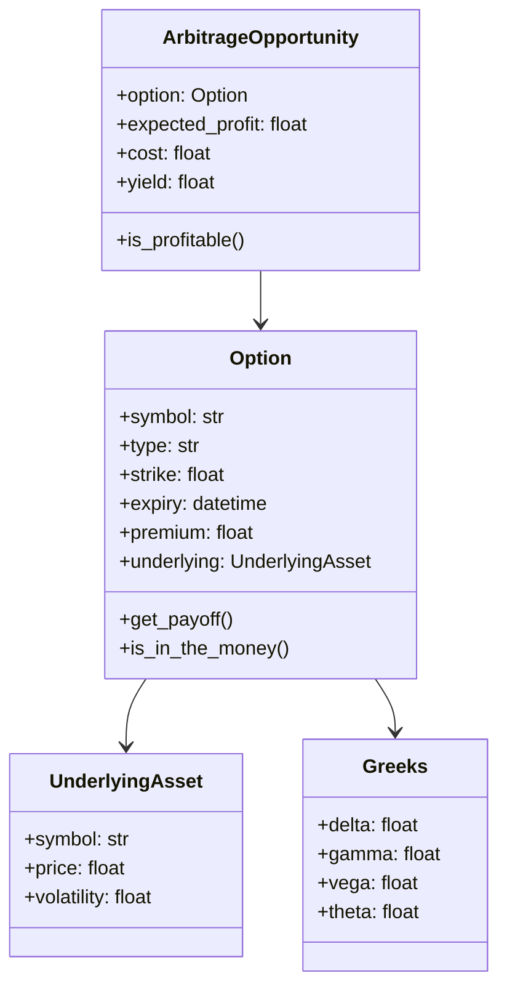

<div dir='rtl'>

# مستند معماری – لایه `entities`

### تعریف لایه Entities در Clean Architecture

> لایه `entities` شامل **موجودیت‌های دامنه (Domain Entities)** و **قوانین بنیادین سیستم** است. این موجودیت‌ها مستقل از ابزارها، پایگاه داده، API یا UI هستند. آن‌ها پایه‌ای‌ترین واحدهای منطقی پروژه هستند که رفتار تجاری (Business Rules) را در خود جای داده‌اند.

---

### هدف این لایه در پروژه ما:

> مدل‌سازی مفاهیم کلیدی بازار آپشن‌های کریپتو مثل Option, Underlying, ArbitrageOpportunity به‌شکلی مستقل، دقیق، و قابل تست.
>
> این موجودیت‌ها باید توانایی انجام محاسبات یا بررسی اعتبار (Validation) را بدون وابستگی به هیچ تکنولوژی خاصی داشته باشند.

---

### کلاس‌ها و ماژول‌های پیشنهادی در `entities`

| کلاس / ماژول    | توضیح                                                                             | دلیل طراحی                                                                           |
| ------------------------ | -------------------------------------------------------------------------------------- | --------------------------------------------------------------------------------------------- |
| `Option`               | مدل کامل یک قرارداد اختیار معامله (Call/Put)               | موجودیت اصلی تحلیل، شامل متدهایی مانند `is_in_the_money()` |
| `UnderlyingAsset`      | دارایی پایه مثل BTC یا ETH                                              | نگهدارنده قیمت و ولتیلیتی برای قیمت‌گذاری آپشن        |
| `ArbitrageOpportunity` | تعریف فرصت آربیتراژ با سود، هزینه و درصد بازدهی | یک موجودیت مستقل قابل ذخیره، نمایش یا هشدار               |
| `OptionLeg`            | بخش یک legs در استراتژی ترکیبی (مثل call در Collar)          | مناسب برای ترکیب در استراتژی‌ها                                    |
| `OptionStrategy`       | استراتژی‌های ترکیبی مثل Spread یا Collar                        | کمک به مدل‌سازی رفتار ترکیبی و ارزیابی آن‌ها             |
| `Greeks`               | شیء ارزش‌محور برای نگهداری Delta, Vega, Gamma                   | برای محاسبه ریسک و انطباق با مدل‌های مالی                   |
| `Money`                | شیء ارزش‌محور برای قیمت‌ها با دقت بالا                 | جلوگیری از خطای float و پشتیبانی چند ارزی                        |
| `TimeToExpiry`         | زمان باقی‌مانده تا انقضا (در روز یا سال)                | مورد استفاده در محاسبات مالی مانند Black-Scholes                 |

---

### دلایل طراحی و استقلال از لایه‌های دیگر:

* این کلاس‌ها **هیچ وابستگی‌ای به پایگاه‌داده، API، فرمت JSON، یا لایبرری‌های خاص** ندارند.
* در صورت تعویض وب‌سرویس یا دیتابیس، هیچ تغییری در `entities` نیاز نیست.
* تست آن‌ها بسیار ساده است (no mocking).

---

### ارتباط بین موجودیت‌ها (درون لایه `entities`)



---

### ارتباط با حلقه‌های بیرونی معماری

| حلقه بیرونی | نحوه تعامل با `entities`                                                                                                                            |
| --------------------- | ---------------------------------------------------------------------------------------------------------------------------------------------------------------- |
| `use_cases`         | با استفاده از کلاس‌هایی مثل `Option`و `ArbitrageOpportunity`، منطق کشف فرصت‌ها را پیاده‌سازی می‌کند |
| `interfaces/api`    | داده‌ها را از کاربر گرفته و آن‌ها را به اشیاء `entities`تبدیل می‌کند و برمی‌گرداند                  |
| `infrastructure/db` | اشیاء `entities`را serialize می‌کند یا از روی داده‌های دیتابیس بازسازی می‌کند                                  |
| `data_providers`    | داده‌ها را گرفته و آن‌ها را به موجودیت‌هایی مانند `Option`یا `UnderlyingAsset`مپ می‌کند                   |

---

### اصول طراحی حرفه‌ای رعایت‌شده

| اصل                               | توضیح                                                                                                               |
| ------------------------------------ | ------------------------------------------------------------------------------------------------------------------------ |
| **Single Responsibility**      | هر کلاس فقط یک نقش دارد (Option فقط یک قرارداد را مدل می‌کند)                   |
| **Independence**               | هیچ وابستگی به فریم‌ورک یا ابزارهای I/O ندارد                                         |
| **Immutability (در VOها)** | اشیاء مانند `Greeks`و `Money`تغییرناپذیرند                                                   |
| **Self-validation**            | متدهایی مانند `is_profitable()`یا `is_in_the_money()`درون موجودیت‌ها قرار دارند |
| **Testability**                | می‌توان همه کلاس‌ها را در واحد جداگانه تست کرد                                     |

---

### منابع و الگوهای معتبر

* [Clean Architecture - Uncle Bob](https://8thlight.com/blog/uncle-bob/2012/08/13/the-clean-architecture.html)
* [Domain-Driven Design by Eric Evans](https://domainlanguage.com/ddd/)
* [Designing Data-Intensive Applications - Martin Kleppmann](https://dataintensive.net/)
* [Functional Programming in Finance](https://papers.ssrn.com/sol3/papers.cfm?abstract_id=4235853)
* [Fintech Engineering Principles by Plaid](https://plaid.com/blog/fintech-product-engineering-principles/)


# Option در لایه `entities`

#### ویژگی‌ها (Attributes)

| ویژگی              | نوع                      | توضیح                        |
| ------------------ | ------------------------ | ---------------------------- |
| `contract_name`    | `str`                    | نام استاندارد قرارداد آپشن   |
| `option_type`      | `Enum` (`call` یا `put`) | نوع قرارداد                  |
| `strike_price`     | `float`                  | قیمت اعمال                   |
| `expiry`           | `datetime`               | زمان انقضا                   |
| `premium`          | `float`                  | قیمت فعلی آپشن               |
| `underlying_asset` | `UnderlyingAsset`        | دارایی پایه مانند BTC یا ETH |

---

#### متدهای کلیدی (Behavior)

| متد                                     | خروجی   | توضیح                                           |
| --------------------------------------- | ------- | ----------------------------------------------- |
| `is_in_the_money(spot_price: float)`    | `bool`  | بررسی سودمندی آپشن نسبت به قیمت فعلی دارایی     |
| `get_payoff(spot_price: float)`         | `float` | محاسبه سود نهایی آپشن در زمان سررسید            |
| `get_break_even_price()`                | `float` | محاسبه نقطه‌ی سربه‌سر برای خریدار آپشن          |
| `has_expired(reference_time: datetime)` | `bool`  | بررسی انقضای آپشن در یک زمان مشخص               |
| `is_valid()`                            | `bool`  | بررسی اعتبار منطقی آپشن (مثلاً قیمت منفی نباشد) |

---

#### متدهای حذف‌شده در این نسخه

* `is_out_of_the_money`، `is_at_the_money`: نتیجه این متدها با شرطی ساده روی `is_in_the_money` و `strike_price` قابل استخراج‌اند.
* `get_max_loss`: بیشتر برای use case استراتژی‌ها مفید است نه در خود Option.
* `is_similar_to`: مربوط به مقایسه در استراتژی‌ها یا بک‌تست است، نه درون موجودیت Option.

---

### جدول مستند نهایی برای `Option`

| کلاس / ماژول | توضیح                                                                | دلیل طراحی                                                                                                                                                                                                   |
| ------------ | -------------------------------------------------------------------- | ------------------------------------------------------------------------------------------------------------------------------------------------------------------------------------------------------------ |
| `Option`     | مدل قرارداد اختیار معامله شامل ویژگی‌های اساسی و رفتارهای کلیدی مالی | موجودیت اصلی تحلیل که در اکثر use caseها مانند قیمت‌گذاری، آربیتراژ، استراتژی و هشدار استفاده می‌شود. متدهای انتخاب‌شده منعکس‌کننده رفتارهای ضروری هستند و بقیه به use cases یا value objects منتقل می‌شوند. |

---

* مرزهای `Entity` را بر اساس واقعیت مالی تعیین کنیم
* بدانیم چه مواردی را باید در `Subclass` توسعه دهیم (مثل `CryptoOption`, `StockOption`, `ETFOption`)
* از اصل **Open/Closed** به‌درستی استفاده کنیم

---

## ✅ جدول کاربرد کلاس `Option` در انواع بازارها

| نوع بازار                  | کاربرد `Option`                                                          | تفاوت‌ها و نیازمندی‌های خاص                                                                       | راهکار پیشنهادی                                                                     |
| -------------------------- | ------------------------------------------------------------------------ | ------------------------------------------------------------------------------------------------- | ----------------------------------------------------------------------------------- |
| **کریپتو (Crypto)**        | قراردادهای آپشن بر دارایی‌هایی مثل BTC, ETH در اکسچنج‌هایی مانند Deribit | - نیاز به پشتیبانی از قراردادهای دائمی<br>- کارمزد زیاد و نوسان بالا<br>- تسویه معمولاً با کریپتو | ساخت کلاس `CryptoOption` با ارث از `AbstractOption`                                 |
| **سهام (Stock Options)**   | آپشن‌های Call/Put روی سهام خاص (مثلاً AAPL، TSLA)                        | - تسویه معمولاً با پول نقد<br>- نیاز به تطابق با مدل آمریکایی یا اروپایی<br>- قوانین FINRA یا SEC | ساخت کلاس `StockOption` با اضافه‌کردن ویژگی‌هایی مثل `style: 'european'/'american'` |
| **صندوق‌ها (ETF Options)** | آپشن روی شاخص‌ها یا ETFهای بزرگ (مثلاً SPY، QQQ)                         | - رفتار نزدیک به سهام<br>- نقدشوندگی بالا، ولی تحلیل متفاوت                                       | استفاده از `StockOption` با اندکی تغییر یا یک `ETFOption` اختصاصی در صورت نیاز      |

---

## 📘 تفاوت‌های کلیدی بین این Optionها

| تفاوت              | کریپتو           | سهام                 | ETF         |
| ------------------ | ---------------- | -------------------- | ----------- |
| تسویه              | با رمزارز (BTC)  | با دلار              | با دلار     |
| نوسان              | بسیار زیاد       | متوسط                | کم تا متوسط |
| عمق بازار          | پایین‌تر         | بالا                 | بالا        |
| سبک آپشن           | اغلب اروپایی     | آمریکایی و اروپایی   | اروپایی     |
| نیاز به Greeks     | بله              | بله                  | بله         |
| داده‌های زنجیره‌ای | WebSocket و مشتق | رسمی (Yahoo, Nasdaq) | مشابه سهام  |

---

## ✅ ساختار کلاس‌ها بر اساس ارث‌بری از `AbstractOption`


</div>

```plaintext
AbstractOption (Entity Base)
├── CryptoOption       # ویژگی‌های خاص بازار رمز ارز
├── StockOption        # مناسب بازار سنتی سهام
└── ETFOption (اختیاری) # در صورت نیاز به منطق جداگانه
```
<div dir='rtl'>
---

## ✅ خلاصه

| کلاس                         | کاربرد                                        | ویژگی خاص                                  |
| ---------------------------- | --------------------------------------------- | ------------------------------------------ |
| `AbstractOption`             | ساختار پایه برای هر نوع قرارداد اختیار معامله | تعریف ویژگی‌ها و متدهای عمومی              |
| `CryptoOption`               | بازار مشتقات رمزارزی                          | پشتیبانی از APIهای realtime، هزینه‌های خاص |
| `StockOption`                | بازار سهام سنتی                               | پشتیبانی از سبک‌های مختلف اجرا             |
| `ETFOption` *(در صورت نیاز)* | برای تحلیل آپشن‌های روی صندوق‌های شاخص        | شبیه Stock ولی ممکن است Greeks متفاوت باشد |

---


